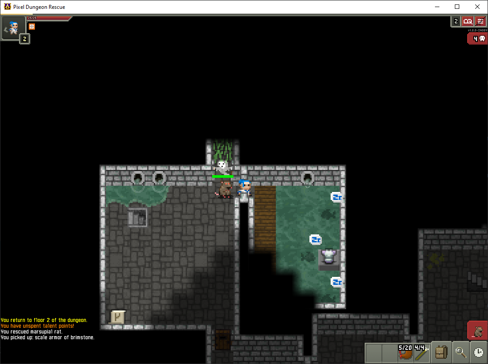

# Pixel Dungeon Rescue

## News

  - Pixel Dungeon Rescue 1.0.0 is released!
    
    Go to [the release page](https://github.com/bcasiello/pixel-dungeon-rescue/releases/tag/v1.0.0)
    to get it!
    
    If you're new to Pixel Dungeon Rescue (and you are, since this is the first release!), you
    should read the rest of this page to see what you're in for.

## Screenshot

Our Intrepid Hero Encounters a Marspial Rat, a Sad Ghost, and Three Sleeping Piranha. A sweet set of
plate armor awaits, on level 2 yet! Noice!
## The Story

Many years ago, Pixel Kingdom was enveloped by a dark magic, which made all the creatures in it
wild and full of rage. A brilliant wizard, Yendor, created a powerful artifact - an amulet that
could absorb this dark magic from a creature and store it inside itself.

"No biggie", said Yendor, "I'm just gonna save the world!"

Yendor went about the country, curing all the creatures she could find, until they were all
restored, and the amulet was full. Yendor and her fellow wizards created a vault deep underground
where the amulet could be stored, for they had not yet devised a way to safely destroy it.

Since that time, the vault became damaged, and the dark magic began to leak out, infesting the
subterranean creatures. Fortunately, the wizards had not been idle. They had devised an enchantment
that could change ordinary weapons so that they would absorb dark magic from creatures instead of
injuring them.

Once a creature has been completely cured, it can be beamed to the surface, rehabilitated, and
release into the wild. But someone has to go underground to clean the dark magic from these
creatures.

Guess what - they picked you!

Travel underground, curing whatever creatures you find. Then, make your way to the vault, retrieve
the Amulet of Yendor, and return it to the surface so its magic too can be cleansed.

Don't be too concerned about being attacked by the creatures below - if you are defeated, you will
be beamed to the surface, healed, and you can try again, without your stuff, but maybe a little
wiser, or at least more careful!

No biggie, you're just gonna save the world!

## The Backstory

It begins, as so many stories do, in the plague times. I'd been zoom-babysitting some of the
grandkids and, well, the adventures of Mr. Bunny were wearing thin. There's only so many times that
Doctor Dinosaur can perform operations on the hapless Bunny, and the shark brothers, Frank and
Charlie, had chases Bunny around the studio for the umpteenth time, and frankly, we had tried
every... single... Scratch anime fairy designer N times over.

One day, I had Shattered Pixel Dungeon up in a background window. The kids noticed, and were
intrigued. I showed them around a bit, and from then  on a session of Shattered was part of every
zoom. They loved it, but it was sometimes a little too scary with all the killing and whatnot.

So Pixel Dungeon Rescue was born. You're not killing creatures, you're curing them and beaming them
to the surface for rehabilitation! You don't die, if you're defeated you get beamed to the surface
and patched up ready to go again! So you lose all your stuff, and you're back at level 1. No biggie!

Like any good software project, soon the entire user base (two kids)were sending in bug reports and
change requests: "I want to be a girl mage!" "I want to be a boy hunter!" "Miso soup should heal
you, it always makes me feel better when I have tummy ache!" "I should be able to bash down
bookshelves!" (Okay, I worry about that kid a bit :-)

My computer died, so the program lay dormant for a while. In the meantime, Evan had updated
Shattered Pixel Dungeon to 1.0 (yay!). I rebuilt the dev environment on my new box, downloaded
the new Shattered code, and ported back my changes.

## The App

A Roguelike RPG, with randomly generated levels, items, enemies, and traps!
Forked from [Shattered Pixel Dungeon](https://github.com/00-Evan/shattered-pixel-dungeon)
which itself is based on the [source code of Pixel Dungeon](https://github.com/00-Evan/pixel-dungeon-gradle),
by [Watabou](https://www.watabou.ru).

Wikipedia has a good write-up on [Roguelike games](https://en.wikipedia.org/wiki/Roguelike) if
you're interested in the history and definition. Here are a few features are common to most
roguelikes:
    1.  Roguelikes are (usually) turn-based. You take a turn, the monsters each take a turn. So when
        it's your turn, you can stop and think for as long as you want, or shut it off and go do
        something else for a while  - it'll be waiting for you exactly where you left off.
    2.  Perma-death - if your character dies, you start over - no saves. Of course, due to its
        theme, you don't actually die in Pixel Dungeon Rescue, you're beamed back to the surface and
        start over again at level 1, without any of your accumulated loot, so it's pretty much
        equivalent.
    3.  Procedurally generated. The levels are (mostly) randomly generated for every game so it's
        different every time you play. There may be some levels (like boss levels or town levels)
        which are the same (or only have a few variations) between games, but most levels are
        random every time. Also, items like potions, rings, and scrolls have to be re-identified
        for each game. Just because a turquoise potion turned out to be a healing potion last game
        doesn't mean it will be in the next.
    4.  Resource management - usually, there is some limited resource (often food) which you need
        to keep finding in order to survive. This prevents you from sitting on level one killing
        weak creatures over and over to level up. Pixel Dungeon Rescue is a little more generous
        in this regard than Shattered, but you will still have to manage your food supply.

Pixel Dungeon Rescue is essentially a light reskinning of Shattered, where the player characters are
trying to cure an infection ravaging the dungeon. It is meant for people (younger children) who
might not be interested in lots of killing but might still enjoy a roguelike game. It's unlikely to
be of interest to serious roguelike gamers. I plan to keep it current with bugfixes and enhancements
from Shattered, as much as possible.

Pixel Dungeon Rescue currently compiles for desktop (tested on Windows and Mac), Android, and iOS.

If you like this game, please consider
[supporting Shattered Pixel on Patreon](https://www.patreon.com/ShatteredPixel)!

If you'd like to work with the code, you can find the following guides in `/docs`:
- [Compiling for Android.](docs/getting-started-android.md)
    - **[If you plan to distribute on Google Play please read the end of this guide.](docs/getting-started-android.md#distributing-your-apk)**
- [Compiling for desktop platforms.](docs/getting-started-desktop.md)
- [Compiling for iOS.](docs/getting-started-ios.md)
- [Recommended changes for making your own mod.](docs/recommended-changes.md)

## Differences from Shattered Pixel Dungeon

  - The story revolves around curing dark magic from the creatures rather than killing them. Lots of
    changes to text were made to support this, and an animation beams up the creatures when
    defeated.
  - All classes can be played as either male or female. (In Shattered, warriors, mages, and rogues
    are always male, huntresses are female.)
    - There are no gameplay differences between the genders of the same class, so there is no
      (dis)advantage in playing one or the other.
    - The splash screens were removed since they only exist for the original Shattered classes.
  - Item silliness - the main food ration is now pizza, healing potions are miso soup, etc.
  - Bookshelves can be destroyed and have a small chance to drop a scroll, and a smaller chance to
    drop the spellbook artifact.
  - Slimes are now jellos, of several colors (and eventually flavors).
  - Levels have a chance at more food and healing potion drops
  - Debug mode changes
    - Saved games are not deleted on defeat (makes it easier to repro bugs)

## How to Build

- Pixel Dungeon Rescue 1.0 is based on Shattered Pixel Dungeon
  1.0.3. Evan's docs on
  [https://github.com/00-Evan/shattered-pixel-dungeon/tree/master/docs](https://github.com/00-Evan/shattered-pixel-dungeon/tree/master/docs)
  apply to this project as well.

- I'm using Android Studio Arctic Fox (2020.3.1). In order to get the
  Android build working, I had to downgrade from Gradle 7 to 6.3, and
  Gradle plugin version 4.0. Once I come up to speed on Gradle, I may
  be able to figure out the problem and move back up to 7.

- The iOS build uses Android Studio and Xcode on macOS Catalina. You'll need to create your own
  signing ID and provisioning profile and plug them into the RoboVM configuration in Android Studio.
  You can create a personal ID and profile in Xcode (if you don't have one already) by creating a
  small project with the same ID as Pixel Dungeon Rescue and setting your ID in Build Settings. You
  don't even have to install or run the project, once Xcode creates your credentials, you're all
  set.

## Bugs, Issues, Change Requests

Feel free to open an issue if you find a bug, or have a good idea for a change!

If you also play Shattered PD, it might be worthwhile to see if the bug exists there, and report it
on that project as well. If not, report it to me, and I'll see if I can reproduce it on Shattered,
and pass the buck to Evan. :-)
